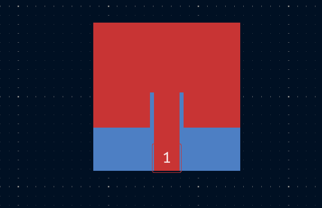

# RFgen

## Features

- Generate RF components.
- Place generated footprints directly on your PCB.
- Configure dimensions through a simple interface.
- Use extra options for ground plane and solder mask exposure.

## Installation

1) Download the [latest release ZIP file](https://github.com/NBalciunas/kicad-rfgen/releases).
2) Open KiCad and in the main window click on "Plugin and Content Manager".
3) Click "Install from File..." and select the downloaded ZIP file.  
4) Restart KiCad — the plugin is now installed.

## Usage

1) Select RF Component from the generate dropdown menu (**Microstrip Patch Antenna** in this example).
2) Set the footprint name.
3) Enter the desired dimensions for the appropriate settings.
4) Adjust extra options (**Include ground plane** or **Remove solder mask** in this example).
5) Click **Generate** to create and place the footprint.

## Example

The following example shows a generated **Microstrip Patch Antenna** footprint using the specified parameters from the **Usage** section.

This illustrates how the footprint is created in both 2D and 3D views, ready for placement on the PCB.

## Future Goals

- Add support for more antenna types.
- Implement memory to recall previous generation settings.
- Provide configurable ground clearance options.
- Explore adding extra RF design tools.

## License

This project is licensed under the MIT License.
Copyright © 2025 Nojus Balčiūnas